# 画面遷移図

アプリ全体の画面遷移。各画面の遷移の条件は、各機能の画面のファイルの「操作と遷移先」に従う。



> 図のソースは [`画面遷移図.01.mmd`](./画面遷移図.01.mmd)（mermaid）。編集後は次で再生成する（プロジェクトのルートフォルダで実行。要 Docker Desktop 起動）:
>
> ```powershell
> docker run --rm -v ${PWD}:/data minlag/mermaid-cli:11.12.0 -i docs/specs/02_basic-design/画面遷移図.01.mmd -o docs/specs/02_basic-design/画面遷移図.01.svg
> ```

## 図に描いていない遷移

- ログインしていない・世帯に未所属・世帯に所属済みの状態に合わせた自動の振り分け（[`00_全体共通.md`](00_全体共通.md#画面の振り分け)）。
- S04 検針票の入力・S08 契約から、タブで S03・S05・S06・S07 へ移る遷移。S04 で入力内容を変えた後は確認を出す（[`00_全体共通.md`](00_全体共通.md#タブ)）。
