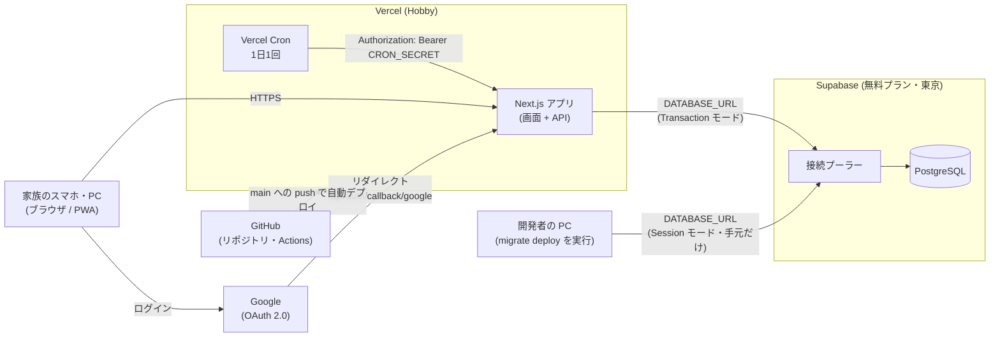

# 00. 概要と全体構成

本番環境の全体像と、決めた方針をまとめる。各サービスの作業手順は 01 以降に分ける。実際の値（プロジェクト ID・本番 URL・接続文字列・シークレット）は書かない。`<プロジェクトID>` のようなプレースホルダで示す。

## 1. 全体構成図

## 2. 各サービスの役割と無料プランの制限

制限の数値は 2026-09 時点の目安。**実際に作業するとき（8-2〜8-4）に各サービスの公式ページで再確認する。**

| サービス | 役割 | 無料枠の主な制限（目安） | このアプリでの影響 |
| --- | --- | --- | --- |
| Vercel（Hobby） | Next.js の実行（画面・API・Server Action）と HTTPS の URL の提供、Cron の実行 | 個人・非商用のみ。Cron は 1 日 1 回まで。関数の実行時間・転送量に上限あり | 家族での利用なので上限には届かない。Cron は 1 日 1 回で足りる |
| Supabase（無料プラン） | 本番の PostgreSQL。使うのは DB だけ（Supabase の認証・Storage は使わない） | 一定期間使われないとプロジェクトが一時停止される。DB の容量に上限あり | データは年 40 件程度で容量は問題ない。一時停止は Cron で防ぐ（下の 3） |
| Google Cloud | Google ログイン（OAuth クライアントと同意画面） | 同意画面が「テスト」状態だと、登録したテストユーザーしかログインできない | 家族だけに限定できる。テストユーザーの上限は 100 人 |
| GitHub | リポジトリと CI（Actions）。main への push を Vercel が検知する | 公開リポジトリの Actions は無料 | 変更なし |

## 3. 決めた方針

| 項目 | 決めたこと | 理由 |
| --- | --- | --- |
| Supabase のリージョン | 東京（`ap-northeast-1`） | 家族が日本から使うため応答が速い |
| Vercel の関数のリージョン | 東京（`hnd1`）に寄せる。手順は 04 | DB と近い場所で動かすと往復が短い |
| ドメイン | Vercel が発行する既定のドメイン（`https://<プロジェクト名>.vercel.app`）を使う。独自ドメインは取らない | 家族向けで足りる。費用もかからない |
| DB への接続 | アプリは Supabase の**接続プーラー（Transaction モード）**経由。マイグレーションは**Session モード**の接続で手元から流す。詳細は 5 | Vercel の関数は同時に多くの接続を作りやすく、DB 側の接続数の上限に当たりやすいため。Supabase の直接接続は IPv6 のみの場合があり、手元の環境から通らないことがある |
| マイグレーション | `prisma migrate deploy` を**手元から手動で**実行する。Vercel のビルドでは実行しない。詳細は 6 | 本番 DB を書き換える操作を、人が見ている場面でだけ行うため（[`prisma_operations.md`](../../prisma_operations.md) の 3） |
| デプロイのきっかけ | `main` への push で Vercel が自動デプロイする | Vercel の標準の動き。docs だけの変更でも再デプロイが走ることは許容する |
| Vercel の環境ごとの設定 | 環境変数は **Production にだけ**設定する。Preview（PR ごとの試し用デプロイ）には本番 DB・Google の値を設定しない | Preview から本番 DB を誤って書き換えないため。Preview の URL は PR ごとに変わり、Google のリダイレクト先にも登録できない。CI が別にビルドを確かめているので、Preview はビルドの確認にとどめる |
| DB の置き場所（8-2 で変更） | 別アプリの Supabase プロジェクトに同居し、本アプリ専用のスキーマ `kounetsuhi_manager` とロール `app_kounetsuhi_manager` を使う。接続文字列の末尾に `?schema=kounetsuhi_manager` を付けてマイグレーションを流す。アプリ側は `client.ts` でスキーマ名を渡す修正が要る（8-4 の前に実施）。詳細は [02](infra_design_02_Supabase.md) | 無料プロジェクトの上限（2 個）に達していたため |
| バックアップ | 機能としては作らない。必要なときに Supabase の管理画面からテーブルを CSV で書き出す（[要件](../01_requirements/00_全体/01_全体要件.md)） | 要件どおり |
| Supabase の一時停止の防止 | Vercel Cron が 1 日 1 回、アプリの専用の URL を呼び、アプリが DB へ `SELECT 1` を送る（[設計](../02_basic-design/00_全体共通.md)） | 無料プランの一時停止を避けるため |

## 4. 現時点でコードに無いもの（本番構築の前に別タスクで実装する）

設計書・要件にはあるが、2026-09-29 時点でコードに存在しない。**8-1 ではコードを変えない。** 実装タスクは TODO に追加してある。

| 項目 | 内容 | 影響する手順 |
| --- | --- | --- |
| Cron 用の URL（**実装済み**: 8-A。`/api/cron/keepalive`） | Vercel Cron が呼ぶ専用の URL（`Authorization: Bearer <CRON_SECRET>` を確かめ、`SELECT 1` を送る）と、Cron の設定（`vercel.json` の `crons`）。環境変数 `CRON_SECRET` を使う | 04（環境変数の設定・Cron の確認）、05 |
| PWA（**実装済み**: 8-B。`src/app/manifest.ts`・`public/icons/`） | ホーム画面に追加するための manifest（名前・アイコン）とアイコン画像。`src/app` に manifest も `public/` にアイコンも無い。オフライン動作・通知は要件どおり対応しない | 05（PWA のインストール確認は、実装後に行う） |

## 5. DB の接続方法の考え方（プーラーとは）

- **接続プーラー**は、アプリと DB の間に置く「接続の受付係」。DB は同時に受けられる接続の数に上限がある。プーラーが少数の接続を使い回し、アプリからの多くの接続を裁く。
- Vercel の関数は、アクセスのたびに新しい実行環境が立ち上がり、それぞれが DB へ接続しようとする。プーラーを挟まないと、少ないアクセスでも DB の接続数の上限に当たることがある。
- Supabase のプーラーには 2 つのモードがある。

| モード | ポート | 向いている用途 | このプロジェクトでの使い方 |
| --- | --- | --- | --- |
| Transaction | 6543 | 短い問い合わせを大量にさばく。1 回の問い合わせごとに接続を貸し出す | **アプリ（Vercel）の `DATABASE_URL`** |
| Session | 5432 | 接続を持ち続ける処理。マイグレーションのような長い処理 | **`prisma migrate deploy` を手元で流すときだけ** |

- Prisma のマイグレーションは、接続を持ち続ける前提の操作（排他ロックなど）を使うため、Transaction モードでは失敗することがある。よって Session モードで流す。
- 環境変数の名前は増やさない。`prisma.config.ts` は `DATABASE_URL` を読むので、**手元のシェルにだけ** Session モードの接続文字列を `DATABASE_URL` として設定して流す（[`prisma_operations.md`](../../prisma_operations.md) の 3-1）。Vercel の `DATABASE_URL` には Transaction モードの文字列を設定する。
- アプリのコード（`src/shared/db/client.ts`）は `@prisma/adapter-pg` で `DATABASE_URL` へ接続する。**8-4 で実際に接続できるかを確かめる**（Transaction モードで問題が出た場合は、Session モードに切り替える判断を 04 に書く）。

## 6. マイグレーションの流し方の方針

| 項目 | 方針 |
| --- | --- |
| コマンド | `pnpm exec prisma migrate deploy` のみ。`migrate dev` / `migrate reset` / `db push` / seed の再実行は本番に対して実行しない |
| 実行する場所 | 開発者の PC から。`DATABASE_URL` は実行するシェルにだけ Session モードの本番の接続文字列を設定し、終わったら消す（ファイル・履歴に残さない） |
| タイミング | 初回は 8-2（アプリのデプロイより前）。以降は、スキーマを変える PR をマージする前後に、コードとの順序に注意して流す（後方互換なら順序は自由。そうでなければ expand → contract、[`prisma_operations.md`](../../prisma_operations.md) の 3-2） |
| 流す前の確認 | 流すマイグレーションが CI（使い捨て DB）で 0 から通っていること。`migration.sql` を目視レビュー済みであること |
| 失敗したとき | 失敗した migration は未適用のまま残る。原因を直す**新しいマイグレーション**を追加して再度 `migrate deploy` する（適用済みの編集・削除はしない）。アプリは Vercel の「以前のデプロイに戻す」で直前の状態へ戻す。詳細は [`prisma_operations.md`](../../prisma_operations.md) の 3-4 |

## 7. 手順書とタスク（8-2〜8-6）の対応

| タスク | 手順書 | 主な内容 |
| --- | --- | --- |
| 8-1 構成と手順の設計 | 00・01（と各手順書の章立て） | この設計書 |
| 8-2 本番用 DB を作る | [`02_Supabase`](infra_design_02_Supabase.md) | プロジェクト作成・接続文字列の控え・`migrate deploy` |
| 8-3 Google ログインの本番設定 | [`03_Googleログイン`](infra_design_03_Googleログイン.md) | OAuth クライアント・リダイレクト先・テストユーザー |
| 8-4 Vercel にデプロイ | [`04_Vercel`](infra_design_04_Vercel.md) | リポジトリ連携・環境変数・リージョン・Cron・ビルド確認 |
| 8-5 本番の動作確認 | [`05_動作確認と運用`](infra_design_05_動作確認と運用.md) | 全体の通し確認・PWA のインストール |
| 8-6 運用の取り決め | 同上 | バックアップ・無料プランの制限・障害時の戻し方・README の更新 |

実施順は 8-2 → 8-3 → 8-4 → 8-5 → 8-6。ただし本番 URL は 8-4 で Vercel にプロジェクトを作るまで確定しないため、**Google のリダイレクト先の登録（8-3）は、Vercel のプロジェクトだけ先に作って URL を確定してから行う**（詳細は 03・04）。

環境変数の対応表は [`01_事前準備`](infra_design_01_事前準備.md) に置く。
